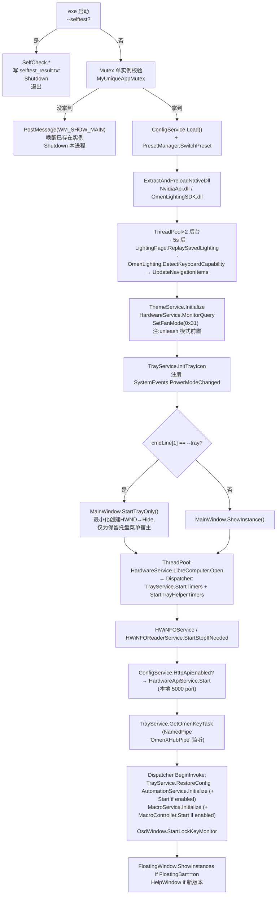
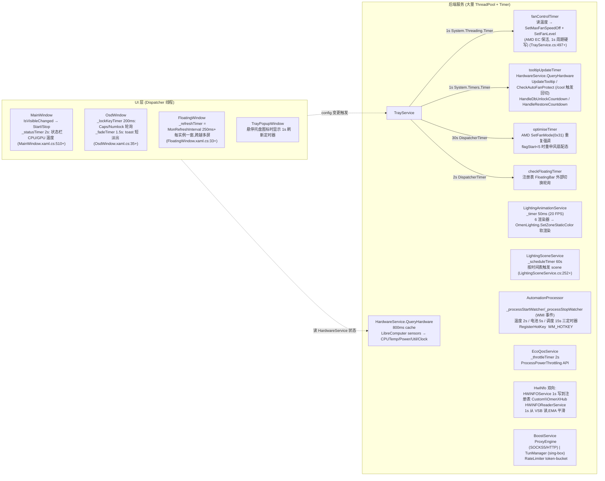
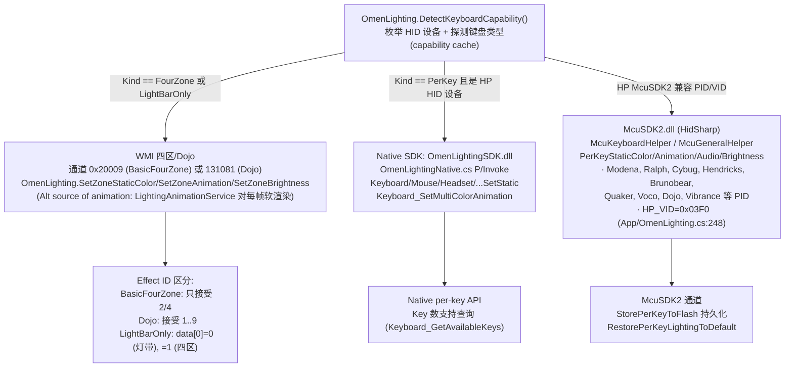
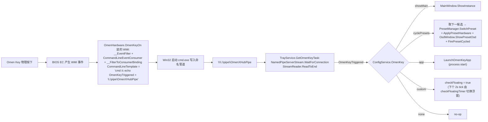
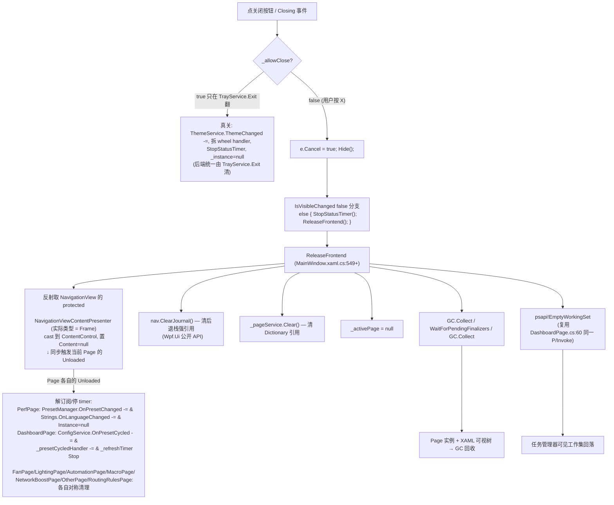
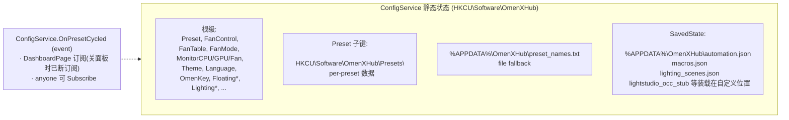
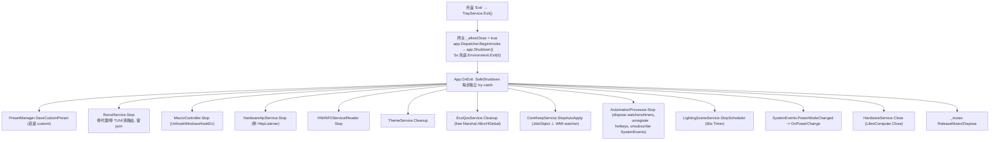

# OmenXHub 架构总览

按本仓 `AGENTS.md` 的 ponytail 准则,本文件只画核心数据流和真实的 call graph,不重复 README 已有内容、不写营销话术。所有引用都给到 file:line。

## 1. 进程启动 (`App.OnStartup`, App.xaml.cs:25)



## 2. 运行时主循环 / 定时器矩阵



## 3. 硬件控制底座 (Hardware Layer, `OmenHardware.cs`)

**所有 EC / 风扇 / 功耗 / 灯效控制都通过同一条 WMI 通道,而非 native IOCTL/PawnIO**(PawnIO 只用于 AMD undervolt 的 SMU):

```mermaid
flowchart TD
  subgraph Entry["WMI 入口 (唯一)"]
    SendWmi["OmenHardware.SendOmenBiosWmi\n(cmdType, data, outputSize,\n command = 0x20008 | 0x20009 | 0x2000B)"]
  end

  subgraph WMI["WMI 命名空间 root\wmi"]
    HBI["hpqBIntM (ManagementObject, 缓存为 _biosMethods)"]
    HDI["hpqBDataIn {Command, CommandType, Sign=[SECU], hpqBData, Size}"]
    HBM["hpqBIOSInt{outputSize}  方法返回 OutData{rwReturnCode, Data}"]
    HBI --> HDI --> HBM --> SendWmi
  end

  subgraph Cmd["commandType 真实动作表"]
    C10["0x10 命令\nUnleash 模式前置\nResume 后 EC 唤醒"]
    C1A["0x1A\nSetFanMode(0x31 perf/0x30 default)"]
    C27["0x27\nSetMaxFanSpeedOn/Off\nAMD EC 保活关键"]
    C2E["0x2E\nSetFanLevel(pct1,pct2) 写入目标RPM"]
    C29["0x29\nSetCpuPowerLimit PL1/PL2\nSetConcurrentTdp (TPP)"]
    C37["0x37\nSetCpuPowerLimitPL4 (双字节)\nIccMax, LoadLine"]
    C22["0x22\nSetGpuPowerState CTGP/PPAB/dState\nGetGpuPowerState"]
    C21["0x21\nGetGpuPowerState(读)"]
    C23["0x23\nGetSensorTemperature IR/Amb/PCH/VR"]
    C28["0x28\nGetSystemDesignData(缓存) 机型能力位"]
  end

  subgraph LED["灯效 channel 0x20009 (hpagx BIOS)"]
    L02["0x02 GetZoneStaticColor (BasicFourZone)"]
    L03["0x03 SetLightColor 写色表 (BasicFourZone)"]
    L05["0x05 Backlight on/off, SetBrightness, SetZoneBrightness"]
    L07["0x07 SetZoneAnimation BasicFourZone effectId 限 2/4"]
    L0B["0x0B=11 Dojo 写 SetZoneStaticColor/Animation/Brightness\neffectId 接受 1..9"]
    L0C["0x0C=12 GetCurrentAnimationEffect (Dojo)"]
    L2B["0x2B GetKeyboardType → NbKeyboardLightingType"]
  end

  subgraph Win["command 0x2000B (Win/Gaming 键)"]
    W00["GetWinLock/SetWinLock EC Win/Gaming 键硬件锁"]
  end

  SendWmi --> C10 & C1A & C27 & C2E & C29 & C37 & C22 & C21 & C23 & C28
  SendWmi --> L02 & L03 & L05 & L07 & L0B & L0C & L2B
  SendWmi --> W00
```



## 4. 灯光控制双路径 (`App/OmenLighting.cs`)



## 5. 预设 / 配置链 (`PresetManager` + `ConfigService`)

```mermaid
flowchart LR
  Trigger["触发点:\n  · 用户托盘菜单 "循环预设" → OmenKey pipe\n  · SettingsPage 用户切换\n  · AutomationProcessor 自动条件触发\n  · Resume 后 OnPowerChange → RestorePowerConfig"]
  Trigger --> Switch["PresetManager.SwitchPreset(preset)\n· 1.1 用 ApplyPresetData 同步 ConfigService 字段\n· 1.2 仅 custom preset 再覆盖\n· 发出 OnPresetChanged (Dispatcher.Invoke)"]

  Switch --> Apply["PresetManager.ApplyPresetHardware()\n单 ThreadPool.QueueUserWorkItem\n原子化硬件写入"]

  Apply --> A1["OmenHardware.SetFanMode(0x31)"]
  Apply --> A2["OmenHardware.SetCpuPowerLimit +\n  SetPL4DoubleByte +\n  AmdUndervoltService.SetAllCoreCO/ApplyPerCoreCO"]
  Apply --> A3["OmenHardware.SetConcurrentTdp (TPP)\n  ⚠ 必须 GPU power 前,否则 PPAB 读旧预算"]
  Apply --> A4["OmenHardware.SetGpuPowerState CTGP/PPAB/dState"]
  Apply --> A5["OmenHardware.SetMaxFanSpeedOff + SetFanLevel\n  FanService.ApplyPresetCurve (custom_<preset>.txt)\n  fanControlTimer.Change"]
  Apply --> A6["GpuAppManager.Set[Core/Memory]ClockOffset\n  NVAPI_SetMaxFrameRate\n  PowerSetActiveScheme + PowerSetActiveOverlayScheme"]
  Apply --> A7["EcoQosService.SetEnabled/SetThrottlePlugged\n  CoreKeepService.StartAutoApply/StopAutoApply"]
  Apply --> A8["TrayService.ApplyRefreshRate (DEVMODE)"]

  Switch -.幂等发火.-> Lss["PresetManager.OnPresetChanged →\nLightingSceneService.NotifyPresetChanged → 可能改场景"]
  Switch -.-> CFC["ConfigService.FirePresetCycled →\nDashboardPage 更新 preset 标\n(关面板时已断订阅 ReleaseFrontend)"]
```

## 6. 跨进程 Omen Key 触发 (E.1)



## 7. 关闭主面板的前端释放流程 (F.1-F.3,本次补丁新增)



注意:**后端进程链路不动** —— HardwareService / fanControlTimer / tooltipUpdateTimer / AutomationProcessor / MacroController / OmenKey pipe / TrayService timer / SystemEvents.PowerModeChanged 全部按 TrayService/App 持有,不受窗口可见性影响。从最小化唤回(不经过 Hide,只在窗口可见+最小化态点托盘)不会触发本流程,保留热缓存。

## 8. 配置 / 持久化



## 9. 进程退出 (`App.OnExit`, App.xaml.cs:285)



## 10. 自检机制 (`--selftest`, App.xaml.cs:30 + RunFrontendReleaseSelfCheck)

`OmenXHub.exe --selftest` → 不启 UI → 跑四个 SelfCheck 函数 + 关面板释放前端内存自检 → 写 `selftest_result.txt` → `Environment.ExitCode = result.Contains("FAIL") ? 1 : 0`。

新增的 `[FrontendRelease]` 段反射驱动 CachedPageService / PerfPage.Unloaded / DashboardPage.Unloaded,断言:
- Patch 3 `CachedPageService._cache` Clear 后 Count == 0
- Patch 1 `PerfPage.Instance` Unloaded 后 == null
- Patch 2 `ConfigService.OnPresetCycled` 中已无 DashboardPage 实例的订阅

## 附录 — 文件 → 责任对照

| 文件 | 责任概要 |
|---|---|
| `App.xaml.cs` | 启动入口、Mutex 单实例、`--selftest`、OnExit 顺序清场 |
| `OmenHardware.cs` | HP BIOS WMI 通道 (`hpqBIntM`) + 灯效 WMI 相关 + GPU/系统检测 |
| `App/OmenLighting.cs` | 灯效双路径(WMI / Native SDK / McuSDK2 HID)+ 键盘能力探测 |
| `Services/OmenLightingNative.cs` | OmenLightingSDK.dll P/Invoke wrap |
| `Services/HardwareService.cs` | LibreHardwareMonitor 传感器 + 800ms 缓存 + GPU AC 检测 |
| `Services/TrayService.cs` | 托盘图标 + 多个 timer 进 + WMI hook + OmenKey pipe + Exit() 清场 |
| `Services/PresetManager.cs` | 内置/自定义预设 + SwitchPreset/ApplyPresetHardware 原子硬件写入 |
| `Services/FanService.cs` | 风扇曲线引擎 (smart EMA + hysteresis + 文件持久化) |
| `Services/AutomationProcessor.cs` | 事件驱动自动化管道 + 3 timer + WM_HOTKEY + WMI watcher |
| `Services/AutomationService.cs` | AutomationPipeline 数据模型 + JSON |
| `Services/MacroController.cs` | WH_KEYBOARD_LL/WH_MOUSE_LL 全局钩子 + 录制回放 |
| `Services/MacroService.cs` | MacroSequence 数据模型 + JSON + trigger-key index |
| `Services/LightingSceneService.cs` | 灯光场景 CRUD + 60s 调度 + 预设联动 |
| `Services/LightingAnimationService.cs` | 4 区软件渲染帧引擎 (20 FPS) |
| `Services/ThemeService.cs` | Dark/Light 系统 + Mica + DWM 口味 |
| `Services/EcoQosService.cs` | ProcessPowerThrottling (后台进程节流) |
| `Services/BoostService.cs` + NetworkBoost/ | 多 NIC 代理 + tun (sing-box.exe) + 速率限制 |
| `Services/HardwareApiService.cs` | 本地 HTTP API (port 5000, X-Auth-Token Guid) |
| `Services/HWiNFOService.cs`/`HWiNFOReaderService.cs` | HWiNFO64 双向 (写自定义传感器 / 读 VSB) |
| `Services/AmdUndervoltService.cs` | AMD Ryzen Curve Optimizer (PawnIO SMU) |
| `Services/CpuAffinity/*` | CoreKeep 持久进程亲和性 (JobObject + WMI watcher) |
| `Views/MainWindow.xaml.cs` | 导航 + 关面板释放 (ReleaseFrontend) + 托盘唤起 WndProc hook |
| `Services/CachedPageService.cs` | Wpf.Ui IPageService + Clear() for ReleaseFrontend |
| `Windows/BaseWindow.cs` | Mica + DPI FluentWindow 基类 |
| `Views/FloatingWindow.xaml.cs` | 多屏浮窗 + PresentMon FPS + 单计时器 |
| `Views/OsdWindow.xaml.cs` | Caps/NumLock 轮询 + preset OSD toast |
| `Views/HelpWindow.xaml.cs` | 关于窗 (singleton) |
| `Views/TrayPopupWindow.xaml.cs` | 托盘悬停弹窗 (1s 刷新) |
| `Pages/*` | 各功能页 (Dashboard / Fan / Perf / Lighting / Automation / Macro / NetworkBoost / CoreKeep / RoutingRules / Other / Settings) + 各页 Loaded/Unloaded 对称清理 |
```
