<div align="center">

# OMEN X Hub

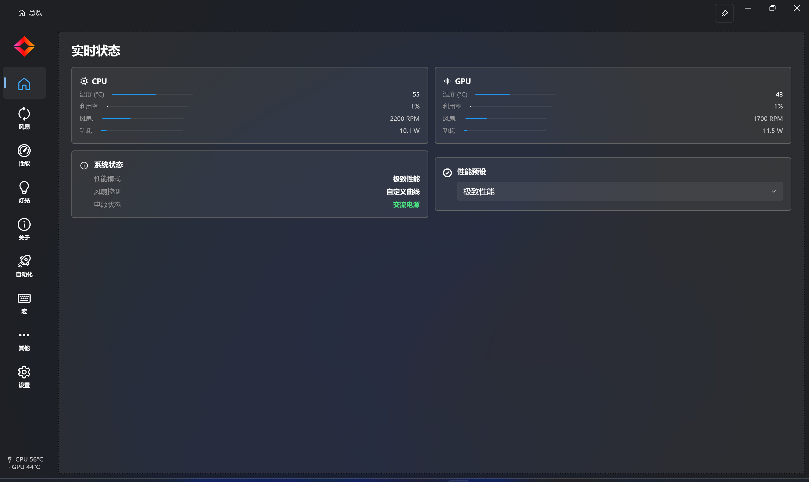

**OMEN X Hub** — A lightweight, offline replacement for HP OMEN Gaming Hub.
No advertisements · No wallpapers · No network connections.

[简体中文](#简体中文) · [繁體中文](#繁體中文) · [English](#english)

</div>

---

# 简体中文

> 轻量、离线的 HP OMEN Gaming Hub 替代品 —— 无广告、无壁纸、无联网。

**OMEN X Hub**（原名 OmenSuperHub）是一个基于 WPF 的 OMEN / VICTUS 游戏本控制中心，提供全面的硬件监控、风扇控制、性能调优、键盘灯光和系统诊断功能，无需安装臃肿的官方 OGH 软件。

## 功能一览

### 仪表板 (Dashboard)

实时显示 CPU/GPU 温度、使用率、频率、功耗、风扇转速、内存占用、网速。颜色编码进度条（绿→黄→红）直观反映负载状态。


### 性能控制 (Performance)

CPU 功率限制 (PL1/PL2)、IccMax、AC Load Line、电源模式/计划、EcoQoS 效率模式、Core Keep 核心保持。GPU 频率限制、核心超频、显存超频、TGP/PPAB、dState、DB 版本、图形模式切换、热切换、屏幕刷新率、最大帧率。

| CPU 控制 | GPU 控制 |
|:---:|:---:|
| 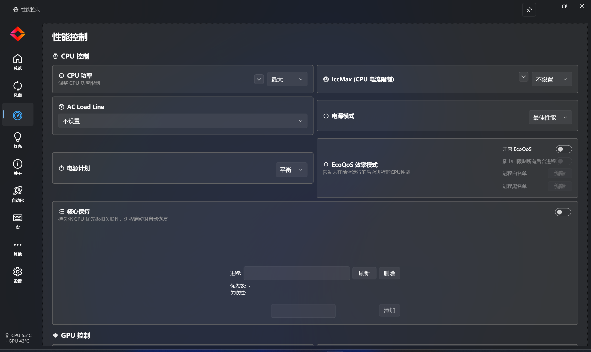 | 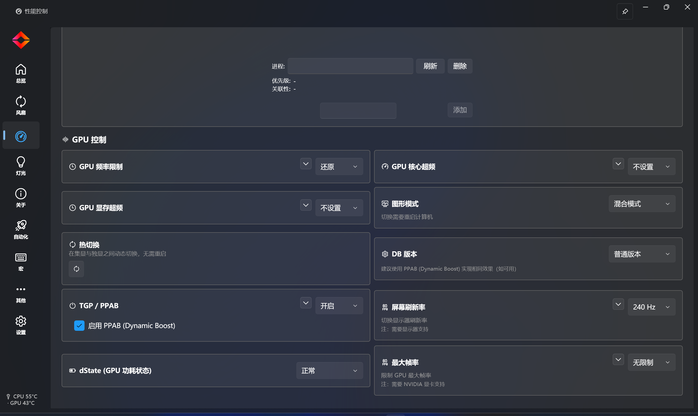 |

### 风扇控制 (Fan)

风扇模式（自动/最大/固定 RPM）、温度灵敏度、自定义风扇曲线（拖拽控制点）、高温自动保护、风扇除尘。

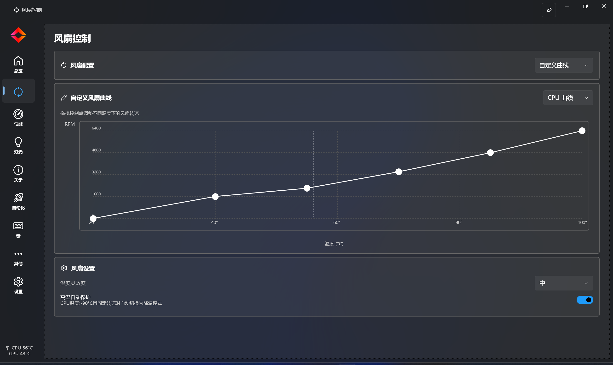

### 灯光控制 (Lighting)

键盘/灯条设备，Basic/Dojo 四分区协议。10 种动画效果、4 区独立颜色、亮度与速度控制。

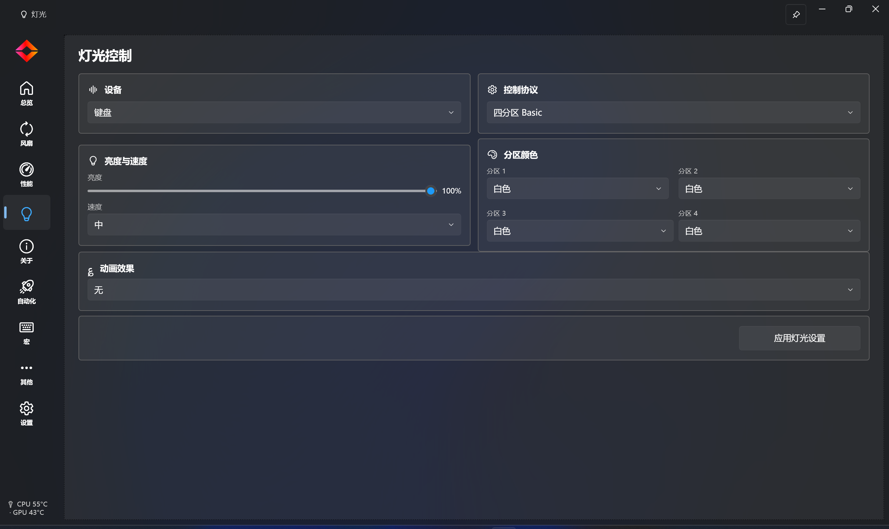

### 自动化 (Automation)

16 种触发条件（进程启动/停止、锁定/解锁、电源插拔、外接显示器、定时、CPU/GPU 温度、电池电量等）+ 23 种执行步骤（预设、刷新率、电源、WiFi/蓝牙、亮度、音频、宏等）。快捷操作可从托盘一键触发。

| 流水线列表 | 编辑管道 |
|:---:|:---:|
| 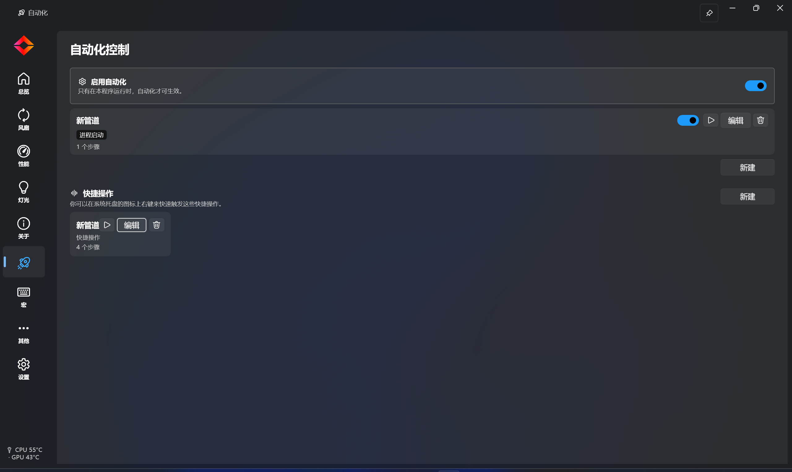 | 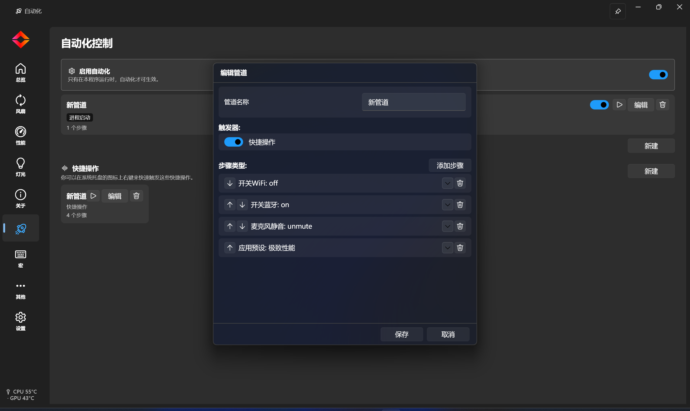 |

### 键盘宏 (Macro)

录制/回放键盘操作序列，支持触发快捷键、事件编辑。

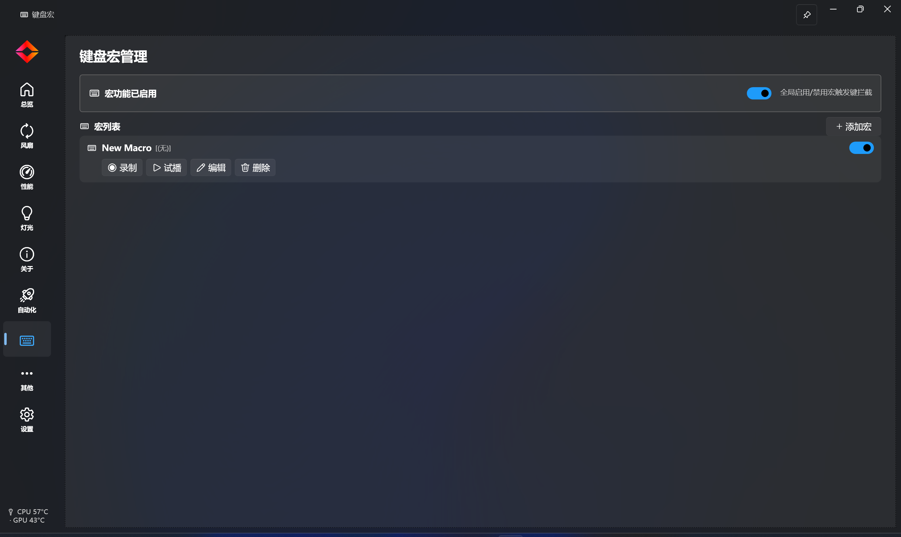

### 其他 (Other)

智能充电、数字锁定、大写锁定、触摸板锁定、HWiNFO64 集成、HTTP API 服务。

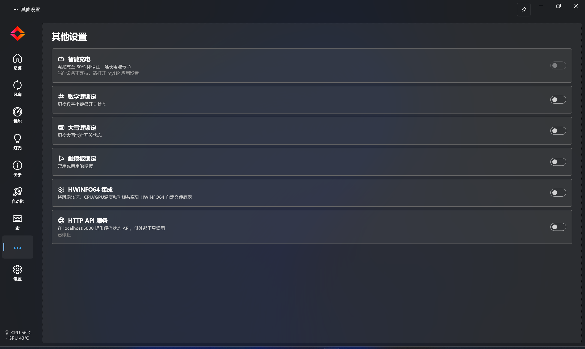

### 系统信息 (SysInfo)

系统硬件详情、PawnIO 驱动状态、传感器温度、GPU 进程管理、监控选项。

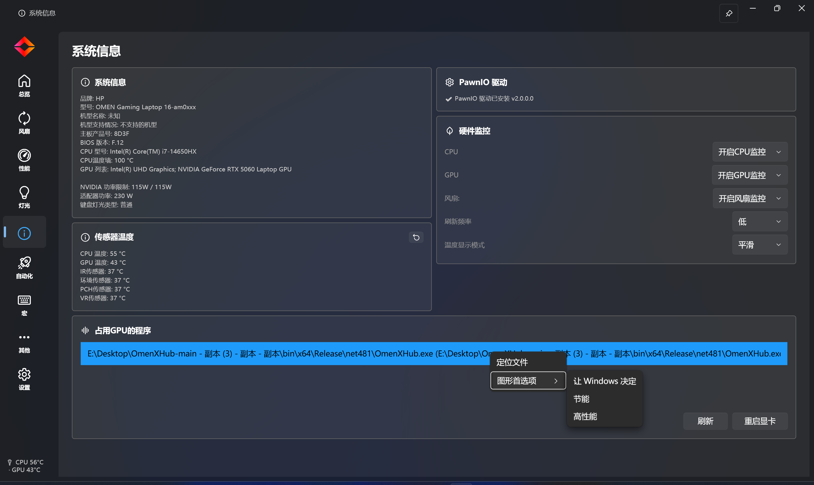

### 设置 (Settings)

浮窗显示（位置/字体/透明度/多显示器）、Omen 键（5 种行为）、OSD 提示、托盘图标（原版/自定义/动态）、开机自启、自定义主界面 LOGO、主题（系统/深色/亮色）、语言、自定义背景（透明度/高斯模糊）、数据本地化、调试日志。

| 浮窗 & Omen 键 | 主题 & 背景 |
|:---:|:---:|
| 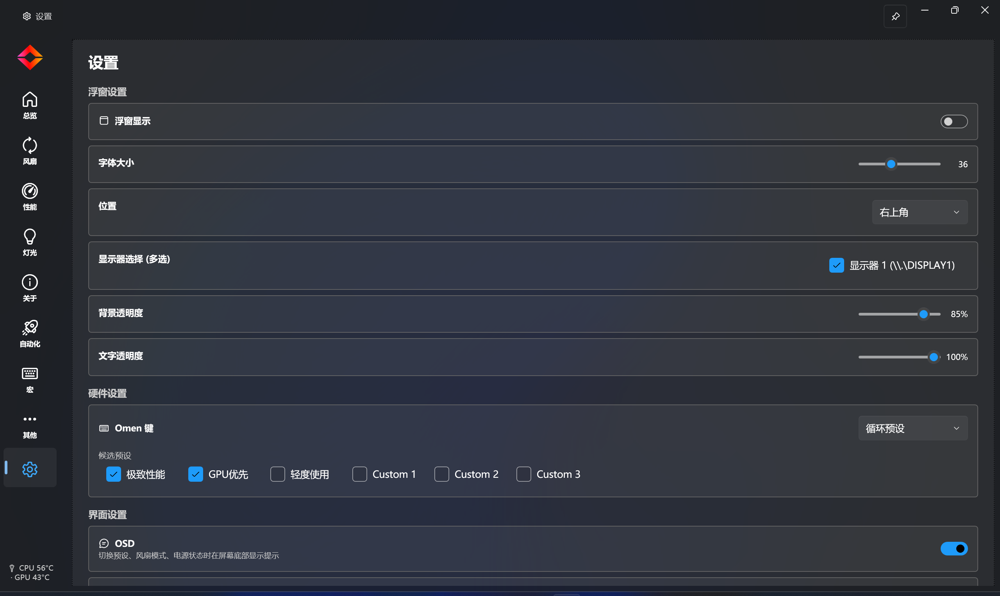 | 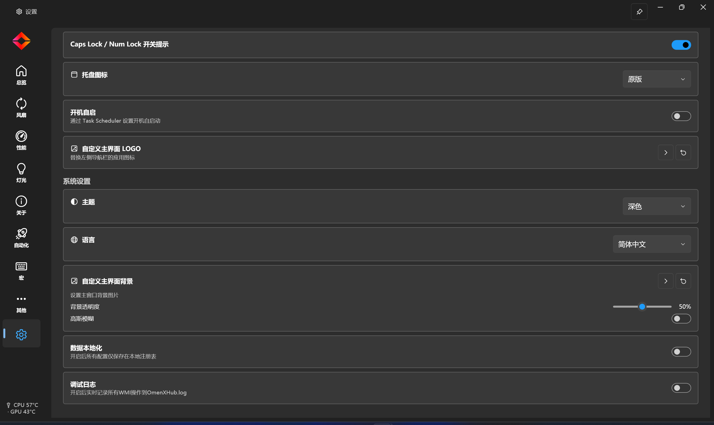 |

## 预设管理

| 预设 | PL1 | PL2 | 风扇 | TGP/PPAB | GPU 频率上限 |
|------|-----|-----|------|----------|-------------|
| 极致性能 (Extreme) | 254W | 254W | Cool | 255W | 无限制 |
| GPU 优先 (GpuPriority) | 45W | 45W | Cool | 255W | 无限制 |
| 轻度使用 (LightUse) | 25W | 25W | Silent | 关闭 | 无限制 |
| 自定义 (Custom 1-3) | 用户保存 | 用户保存 | 用户保存 | 用户保存 | 用户保存 |

仅 CPU 功率、电源计划、GPU 频率上限、TGP+PPAB、dState 跟随预设绑定；灯光、宏、音频等参数独立保存。

## 支持硬件

| 状态 | 型号 |
|------|------|
| 已确认 | 暗影精灵 8 Plus · 8 Plus Plus · 9 · 9 Plus · 10 · 光影精灵 10 · 光影精灵 10 (Victus) · OMEN 16 (Ryzen) · OMEN 15 · OMEN Phantom Gaming |
| 不支持 | 暗影精灵 6 |

> 主要针对 **OMEN 10 Intel (i7-13650HX + RTX 4070)** 开发，兼容性不保证适用于所有平台。

### 环境要求

- HP OMEN / VICTUS 游戏本，具有 WMI BIOS 接口
- Windows 10/11 64-bit · .NET Framework 4.8
- 管理员权限（WMI、风扇控制、驱动安装所需）

## 快速开始

1. **关闭 OGH** — 结束 `OmenCommandCenterBackground.exe` 或卸载 OGH 以避免冲突。
2. **以管理员身份运行** — 硬件控制需要提权。
3. **启动 `OmenXHub.exe`** — 程序在系统托盘运行。
4. **右键托盘图标** 切换性能模式或打开控制面板。
5. **在设置中启用开机自启** 以长期替代 OGH。

> ⚠️ DB (Dynamic Boost) 解锁需要 NVIDIA 驱动版本 ≥ 537.42 且 < 610.47。50 系列 GPU 不支持解锁。

## 构建

```cmd
dotnet restore OmenSuperHub.csproj
set MSBuildSDKsPath=C:\Program Files\dotnet\sdk\8.0.418\Sdks
set MSBuildEnableWorkloadResolver=false
MSBuild.exe OmenSuperHub.csproj /t:Build /p:Configuration=Release /p:Platform=x64
```

输出：`bin\x64\Release\OmenXHub.exe`（单文件 — 所有 DLL 通过 Costura.Fody 嵌入）

## 致谢

- **MasonDye** — GUI 设计与 WPF 前端开发
- **breadeding** — [OmenSuperHub](https://github.com/breadeding/OmenSuperHub)（原始框架与代码）
- **GeographicCone** — [OmenMon](https://github.com/GeographicCone) / [OmenHwCtl](https://github.com/GeographicCone)（灵感来源与 OGH 交互研究）
- **OpenHardwareMonitor** — [LibreHardwareMonitor](https://github.com/LibreHardwareMonitor/LibreHardwareMonitor)（硬件监控核心库）

## 免责声明

OMEN X Hub **与 HP 或 OMEN 无关联**。品牌名称仅作参考。本软件直接与硬件交互，可能存在潜在风险。**使用风险自负。**

---

# 繁體中文

> 輕量、離線的 HP OMEN Gaming Hub 替代品 —— 無廣告、無牆紙、無聯網。

**OMEN X Hub**（原名 OmenSuperHub）是一個基於 WPF 的 OMEN / VICTUS 遊戲筆電控制中心，提供全面的硬體監控、風扇控制、效能調校、鍵盤燈光和系統診斷功能，無需安裝臃腫的官方 OGH 軟體。

## 功能一覽

### 儀表板 (Dashboard)

即時顯示 CPU/GPU 溫度、使用率、頻率、功耗、風扇轉速、記憶體佔用、網速。顏色編碼進度條（綠→黃→紅）直觀反映負載狀態。


### 效能控制 (Performance)

CPU 功率限制 (PL1/PL2)、IccMax、AC Load Line、電源模式/計畫、EcoQoS 效率模式、Core Keep 核心保持。GPU 頻率限制、核心超頻、記憶體超頻、TGP/PPAB、dState、DB 版本、圖形模式切換、熱切換、螢幕更新率、最大幀率。

| CPU 控制 | GPU 控制 |
|:---:|:---:|
|  |  |

### 風扇控制 (Fan)

風扇模式（自動/最大/固定 RPM）、溫度靈敏度、自訂風扇曲線（拖曳控制點）、高溫自動保護、風扇除塵。


### 燈光控制 (Lighting)

鍵盤/燈條裝置，Basic/Dojo 四分區協議。10 種動畫效果、4 區獨立顏色、亮度與速度控制。


### 自動化 (Automation)

16 種觸發條件（程序啟動/停止、鎖定/解鎖、電源插拔、外接顯示器、定時、CPU/GPU 溫度、電池電量等）+ 23 種執行步驟（預設、更新率、電源、WiFi/藍牙、亮度、音訊、巨集等）。快捷操作可從匣標（系統列）一鍵觸發。

| 流水線清單 | 編輯管道 |
|:---:|:---:|
|  |  |

### 鍵盤巨集 (Macro)

錄製/回放鍵盤操作序列，支援觸發快捷鍵、事件編輯。


### 其他 (Other)

智慧充電、數字鎖定、大寫鎖定、觸控板鎖定、HWiNFO64 整合、HTTP API 服務。


### 系統資訊 (SysInfo)

系統硬體詳情、PawnIO 驅動狀態、感測器溫度、GPU 程序管理、監控選項。


### 設定 (Settings)

浮窗顯示（位置/字型/透明度/多顯示器）、Omen 鍵（5 種行為）、OSD 提示、匣標圖示（原版/自訂/動態）、開機自啟、自訂主介面 LOGO、主題（跟隨系統/深色/亮色）、語言、自訂背景（透明度/高斯模糊）、資料本地化、除錯日誌。

| 浮窗 & Omen 鍵 | 主題 & 背景 |
|:---:|:---:|
|  |  |

## 預設管理

| 預設 | PL1 | PL2 | 風扇 | TGP/PPAB | GPU 頻率上限 |
|------|-----|-----|------|----------|-------------|
| 極致效能 (Extreme) | 254W | 254W | Cool | 255W | 無限制 |
| GPU 優先 (GpuPriority) | 45W | 45W | Cool | 255W | 無限制 |
| 輕度使用 (LightUse) | 25W | 25W | Silent | 關閉 | 無限制 |
| 自訂 (Custom 1-3) | 使用者儲存 | 使用者儲存 | 使用者儲存 | 使用者儲存 | 使用者儲存 |

僅 CPU 功率、電源計畫、GPU 頻率上限、TGP+PPAB、dState 跟隨預設綁定；燈光、巨集、音訊等參數獨立儲存。

## 支援硬體

| 狀態 | 型號 |
|------|------|
| 已確認 | 暗影精靈 8 Plus · 8 Plus Plus · 9 · 9 Plus · 10 · 光影精靈 10 · 光影精靈 10 (Victus) · OMEN 16 (Ryzen) · OMEN 15 · OMEN Phantom Gaming |
| 不支援 | 暗影精靈 6 |

> 主要針對 **OMEN 10 Intel (i7-13650HX + RTX 4070)** 開發，相容性不保證適用於所有平台。

### 環境要求

- HP OMEN / VICTUS 遊戲筆電，具有 WMI BIOS 介面
- Windows 10/11 64-bit · .NET Framework 4.8
- 管理員權限（WMI、風扇控制、驅動安裝所需）

## 快速開始

1. **關閉 OGH** — 結束 `OmenCommandCenterBackground.exe` 或解除安裝 OGH 以避免衝突。
2. **以管理員身份執行** — 硬體控制需要提權。
3. **啟動 `OmenXHub.exe`** — 程式在匣標（系統列）運行。
4. **右鍵匣標圖示** 切換效能模式或開啟控制面板。
5. **在設定中啟用開機自啟** 以長期替代 OGH。

> ⚠️ DB (Dynamic Boost) 解鎖需要 NVIDIA 驅動版本 ≥ 537.42 且 < 610.47。50 系列 GPU 不支援解鎖。

## 建置

```cmd
dotnet restore OmenSuperHub.csproj
set MSBuildSDKsPath=C:\Program Files\dotnet\sdk\8.0.418\Sdks
set MSBuildEnableWorkloadResolver=false
MSBuild.exe OmenSuperHub.csproj /t:Build /p:Configuration=Release /p:Platform=x64
```

輸出：`bin\x64\Release\OmenXHub.exe`（單一檔案 — 所有 DLL 透過 Costura.Fody 嵌入）

## 致謝

- **MasonDye** — GUI 設計與 WPF 前端開發
- **breadeding** — [OmenSuperHub](https://github.com/breadeding/OmenSuperHub)（原始框架與程式碼）
- **GeographicCone** — [OmenMon](https://github.com/GeographicCone) / [OmenHwCtl](https://github.com/GeographicCone)（靈感來源與 OGH 互動研究）
- **OpenHardwareMonitor** — [LibreHardwareMonitor](https://github.com/LibreHardwareMonitor/LibreHardwareMonitor)（硬體監控核心庫）

## 免責聲明

OMEN X Hub **與 HP 或 OMEN 無關聯**。品牌名稱僅作參考。本軟體直接與硬體互動，可能存在潛在風險。**使用風險自負。**

---

# English

> A lightweight, offline replacement for HP OMEN Gaming Hub — no advertisements, no wallpapers, no network connections.

**OMEN X Hub** (formerly OmenSuperHub) is a WPF-based control center for HP OMEN / VICTUS gaming laptops. It provides comprehensive hardware monitoring, fan control, performance tuning, keyboard lighting, and system diagnostics — all without the bloat of the official OGH software.

## Features

### Dashboard

Real-time CPU/GPU temperature, usage, frequency, power, fan speed, RAM usage, and network speed. Color-coded progress bars (green → yellow → red) reflect load at a glance.


### Performance Control

CPU power limits (PL1/PL2), IccMax, AC Load Line, power plan/mode, EcoQoS efficiency mode, Core Keep. GPU frequency lock, core/memory overclock, TGP/PPAB, dState, DB version, graphics mode switching, hot switch, display refresh rate, max frame rate.

| CPU Control | GPU Control |
|:---:|:---:|
|  |  |

### Fan Control

Fan modes (Auto / Max / Fixed RPM), temperature sensitivity, custom fan curve (drag-and-drop), high-temp auto-protection, fan dust removal.


### Lighting Control

Keyboard / light bar devices, Basic/Dojo 4-zone protocols. 10 animation effects, per-zone colors, brightness and speed control.


### Automation

16 trigger types (process start/stop, session lock/unlock, AC/DC, display connect/disconnect, schedule, CPU/GPU temp, battery level) + 23 step types (preset, refresh rate, power, WiFi/Bluetooth, brightness, audio, macro, etc.). Quick actions triggerable from tray menu.

| Pipeline List | Edit Pipeline |
|:---:|:---:|
|  |  |

### Keyboard Macro

Record and replay keyboard sequences, with trigger hotkey support and event editing.


### Other

Smart charging, Num Lock, Caps Lock, touchpad lock, HWiNFO64 integration, HTTP API service.


### System Info

Hardware details, PawnIO driver status, sensor temperatures, GPU process management, monitoring options.


### Settings

Overlay display (position / font / opacity / multi-monitor), Omen Key (5 behaviors), OSD toast, tray icon (default / custom / dynamic), auto-start, custom main logo, theme (system / dark / light), language, custom background (opacity / Gaussian blur), data localization, debug log.

| Overlay & Omen Key | Theme & Background |
|:---:|:---:|
|  |  |

## Preset Management

| Preset | PL1 | PL2 | Fan | TGP/PPAB | GPU Freq Limit |
|--------|-----|-----|-----|----------|----------------|
| Extreme | 254W | 254W | Cool | 255W | Unlimited |
| GpuPriority | 45W | 45W | Cool | 255W | Unlimited |
| LightUse | 25W | 25W | Silent | Off | Unlimited |
| Custom 1-3 | User saved | User saved | User saved | User saved | User saved |

Only CPU power, power plan, GPU frequency limit, TGP+PPAB, and dState are bound to presets; lighting, macros, audio, and other params persist independently.

## Supported Hardware

| Status | Models |
|--------|--------|
| Confirmed | 暗影精灵 8 Plus · 8 Plus Plus · 9 · 9 Plus · 10 · 光影精灵 10 · 光影精灵 10 (Victus) · OMEN 16 (Ryzen) · OMEN 15 · OMEN Phantom Gaming |
| Not supported | 暗影精灵 6 |

> Primarily developed for **OMEN 10 Intel (i7-13650HX + RTX 4070)**. Compatibility not guaranteed on all platforms.

### Requirements

- HP OMEN / VICTUS gaming laptop with WMI BIOS interface
- Windows 10/11 64-bit · .NET Framework 4.8
- Administrative privileges (required for WMI, fan control, driver installation)

## Getting Started

1. **Close OGH** — shut down `OmenCommandCenterBackground.exe` or uninstall OGH to avoid conflicts.
2. **Run as Administrator** — all hardware control requires elevated privileges.
3. **Launch** `OmenXHub.exe` — the app runs from the system tray.
4. **Right-click tray icon** to switch performance modes or open the control panel.
5. **Enable auto-start** in settings for long-term OGH replacement.

> ⚠️ DB (Dynamic Boost) unlock requires NVIDIA driver version ≥ 537.42 and < 610.47. 50-series GPUs are not supported for unlock.

## Build

```cmd
dotnet restore OmenSuperHub.csproj
set MSBuildSDKsPath=C:\Program Files\dotnet\sdk\8.0.418\Sdks
set MSBuildEnableWorkloadResolver=false
MSBuild.exe OmenSuperHub.csproj /t:Build /p:Configuration=Release /p:Platform=x64
```

Output: `bin\x64\Release\OmenXHub.exe` (single-file — all DLLs embedded via Costura.Fody)

## Acknowledgments

- **MasonDye** — GUI design & WPF front-end development
- **breadeding** — [OmenSuperHub](https://github.com/breadeding/OmenSuperHub) (original framework & code)
- **GeographicCone** — [OmenMon](https://github.com/GeographicCone) / [OmenHwCtl](https://github.com/GeographicCone) (inspiration & OGH interaction research)
- **OpenHardwareMonitor** — [LibreHardwareMonitor](https://github.com/LibreHardwareMonitor/LibreHardwareMonitor) (hardware monitoring core)

## Disclaimer

OMEN X Hub is **not affiliated with HP or OMEN**. Brand names are used for reference only. This software interacts directly with hardware and may carry potential risks. **Use at your own risk.**
